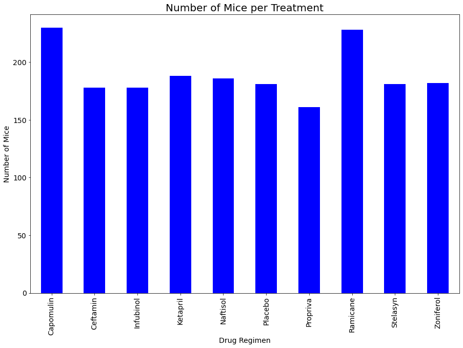
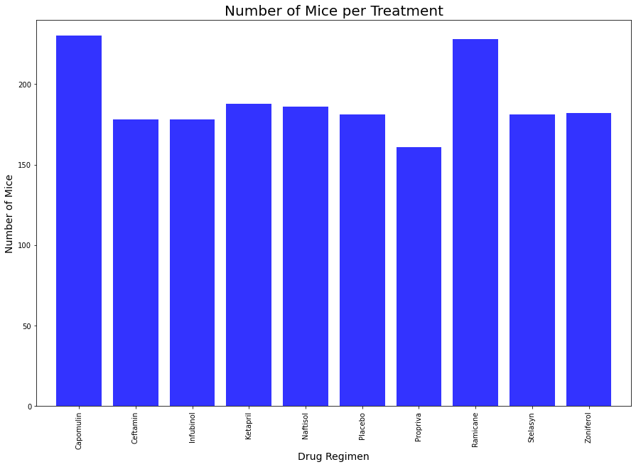
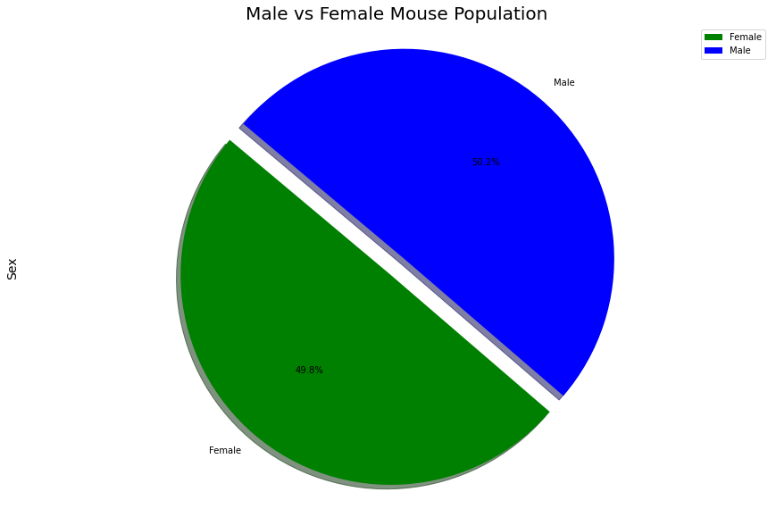
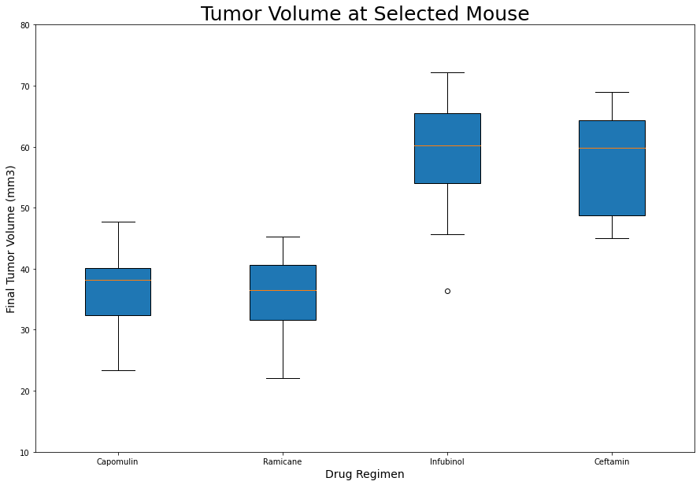
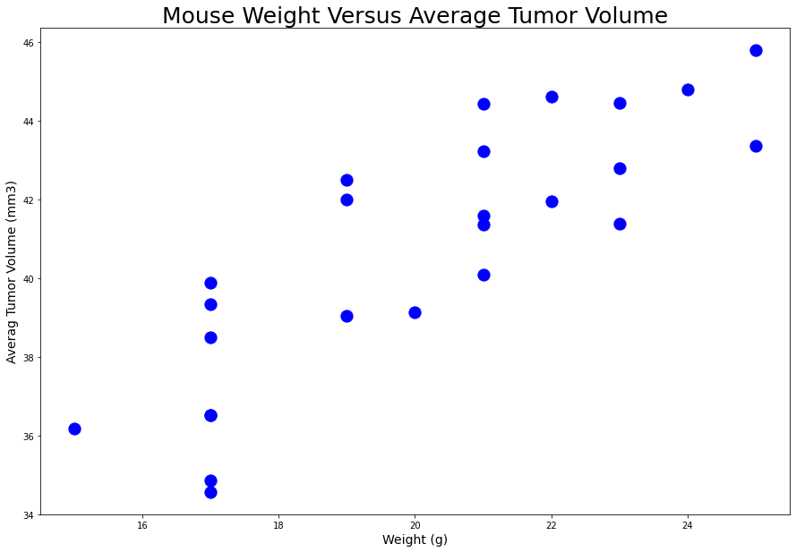
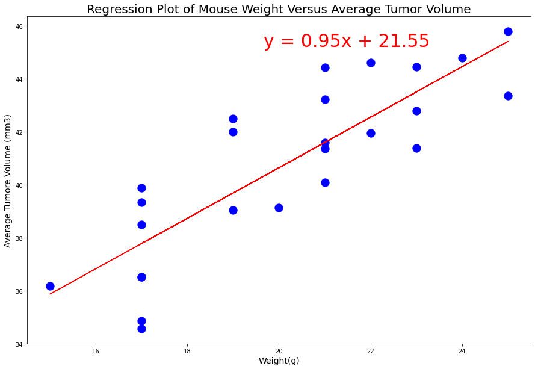
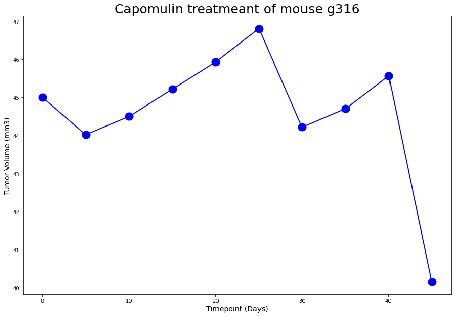

# Hammond-Pymaceutical

#The Power of Plots

## Background

## Analysis 

Analysis
From comparing the results gathered for three drug treatments, Capomulin, Infubinol, Ketapril, and a placebo, the three main observations that can be made are:

When comparing all 4 treatments, the mice given Capomulin outperformed the other 3 treatments in every physiological response tested.

Capomulin was the only treatment out of the four to show success in decreasing tumor volume. The mice given this drug showed a steady decline in tumor volume, with a total decrease by an average of 19% over the course of the 45 day treatment.

When comparing with the placebo, the drugs Infubinol and Ketapril actually had a negative effect on all physiological responses tested. The mice given the placebo had a higher survival rate than those given Infubinol, and showed similar/slightly better results than Ketapril with respect to tumor volume and spread of metastatic sites.

In conclusion, the mice given Capomulin showed improvement in symptoms, while the mice given Infubinol and Ketapril appear be worse off than those treated with a placebo.

## Take Aways 

#1- Capomulin and Ramicane reduces the size of tumors better then others.

#2- As mice weight increases; aveger tumor volume also increases.

#3- Male and Female mice were study almost evenly 124 female to 125 male. 

## Pandas Bar 

## Pyplot Bar 

 

## Pandas Pie

## Pyplot Pie 

## Box & Whisper 

  

## Scatter Plot

## Liner Regression 

## Mouse G316

